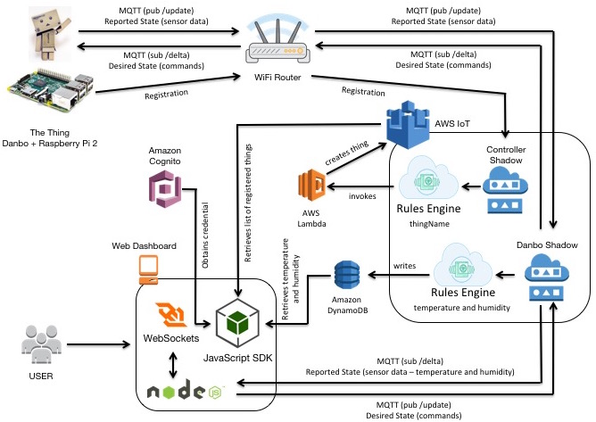

AWS IoT Demo for Danbo
======================

Demo for a cloud-connected Danbo controlled via the AWS IoT service.

Below is the architecture diagram for this project:

Architecture Diagram

For detailed instructions, please follow the [Hackster.io tutorial](https://hackster.io/) (tutorial link to be published soon)
